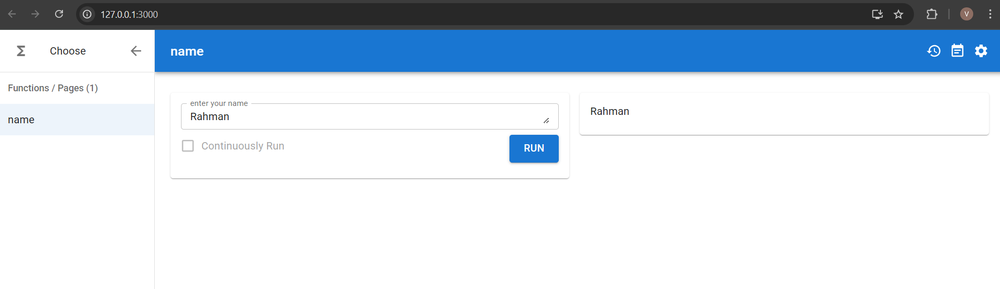
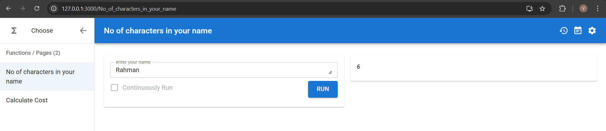
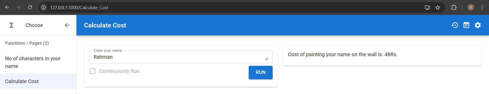
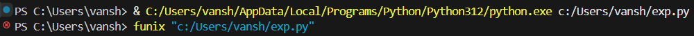
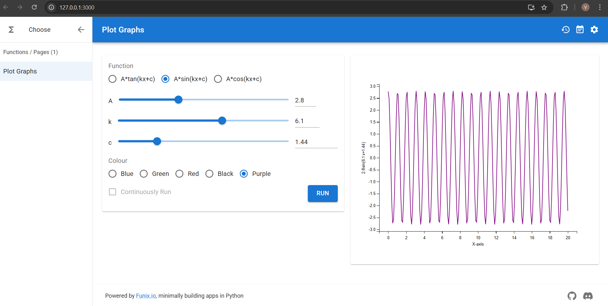
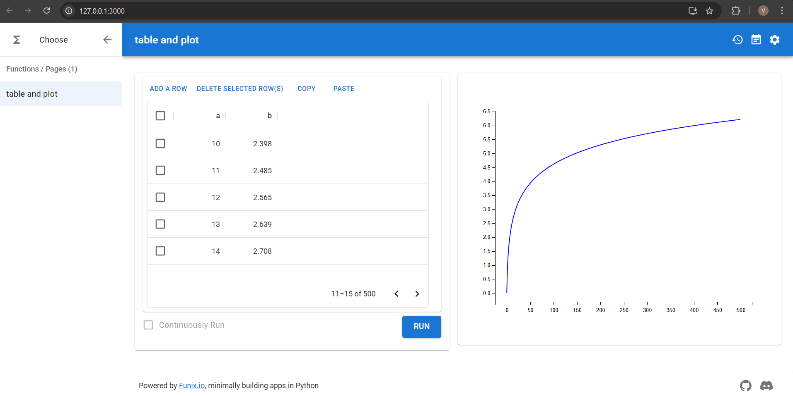

# Overview about Funix

Funix is a python library which converts a python function or class definition into a webapp. Anything that has to be displayed on the screen has to be returned as a function(other than the text which is used for taking an input from the user).
Python objects get mapped to a widget through funix. This happens without manual widget creation in most cases, using its inbuilt type-to-widget mapping system.

Take a look at a basic python program which displays a person's name on the screen after taking it as an input on the webapp.
```python
import funix
def name(enter_your_name:str)->str:
    n=enter_your_name
    return n
```

This is its webapp:


The following is another program which has two functions. We call the first function inside the second one.

```python
import funix
def No_of_characters_in_your_name(enter_your_name:str)->int:
    return len(enter_your_name)

def Calculate_Cost(Enter_your_name:str)->str:
    r=8
    n=No_of_characters_in_your_name(Enter_your_name)
    return(f"Cost of painting your name on the wall is: {r*n}Rs.")
```
On the Webapp:



Note: When we have multiple functions called independently(not nested), they appear separately on a menu bar on the left side of the page and have to be opened and executed separately. 

# For obtaining the webapp for a python program:

1. First run the python file
2. On your terminal run the following program: ```funix {path_to_the_python_file_as_a_string}```

The same steps have been showed on a VS Code Terminal in the image below


# Program for Plotting graphs

The following is a python program for choosing a function(out of three functions- sine,cosine and tangent), which also allows the user to set the amplitude(A), wave number(k), phase constant(c) for the function and the color of the graph(out of four choices).
```python
import funix
import matplotlib.pyplot as plt
import matplotlib.figure
import numpy

def Plot_Graphs(Function: funix.hint.Literal['A*tan(kx+c)', 'A*sin(kx+c)', "A*cos(kx+c)"],A: funix.hint.FloatSlider(0, 8, 0.1), k: funix.hint.FloatSlider(0, 10, 0.1), c: funix.hint.FloatSlider(0, 2*numpy.pi, 0.01),Colour: funix.hint.Literal['Blue', 'Green', 'Red','Black','Purple']) -> matplotlib.figure.Figure:
    fig=plt.figure()
    fn=Function
    x = numpy.linspace(0, 20, 200)
    if fn=="A*tan(kx+c)":
        plt.plot(x,A*(numpy.tan((k*x)+c)),color=Colour)
        plt.ylabel(f"{A}tan({k}x+{c})")
    elif fn=="A*sin(kx+c)":
        plt.plot(x,A*(numpy.sin((k*x)+c)),color=Colour)
        plt.ylabel(f"{A}sin({k}x+{c})")
    else:
        plt.plot(x,A*(numpy.cos((k*x)+c)),color=Colour)
        plt.ylabel(f"{A}cos({k}x+{c})")
    plt.xlabel("X-axis")
    
    return fig
```


This is how the webpage for it looks:


Let's take a few points to note about the above program:
1. In the function definition line of the above program:
    ```python
    def Plot_Graphs(Function: funix.hint.Literal['A*tan(kx+c)', 'A*sin(kx+c)', "A*cos(kx+c)"],A: funix.hint.FloatSlider(0, 8, 0.1), k: funix.hint.FloatSlider(0,       10, 0.1), c: funix.hint.FloatSlider(0, 2*numpy.pi, 0.01),Colour: funix.hint.Literal['Blue', 'Green', 'Red','Black','Purple']) -> matplotlib.figure.Figure:
    ```
    The ```->matplotlib.figure.Figure:``` specifies that the function has to return a ```matplotlib.figure.Figure``` object.

2. In the following line:
    ```A: funix.hint.FloatSlider(0, 8, 0.1), k: funix.hint.FloatSlider(0, 10, 0.1), c: funix.hint.FloatSlider(0, 2*numpy.pi, 0.01)```
    A, k, and c are the float values set using the slider in the webpage.

   and similarly in ```Function: funix.hint.Literal['A*tan(kx+c)', 'A*sin(kx+c)', "A*cos(kx+c)"]``` the variable ```Function``` stores the string variable chosen     using the circle checkboxes in the webpage.

   These parameters are used to plot the graphs using the ```matplotlib.figure```, ```matplotlib.pyplot``` and ```numpy``` libraries.

# Plotting a Dataframe

Take a look at the following program which plots a dataframe and a graph

```python
import pandas, matplotlib.pyplot
from numpy import arange, log
from numpy.random import random

def table_and_plot(
    df: pandas.DataFrame = pandas.DataFrame({
        "a": arange(500),
        "b": log(arange(500)+1) })
    ) -> matplotlib.figure.Figure:

    fig = matplotlib.pyplot.figure()
    matplotlib.pyplot.plot(df["a"], df["b"], 'b')

    return fig
```



In this program, we are plotting the values of column ```a``` along the X-axis and ```b=log(a)``` along the y-axis. 
The ```matplotlib.pyplot()``` function which is being used to plot the graph using the 2 columns of the dataframe also plots the 2 columns as a table. The four columns in the heading are the default columns which appear when displaying the rows of a dataframe using ```matplotlib.pyplot()```.

# Disadvantages of funix
1. On the webapp, the functions have to be executed manually by entering the input and clicking on the "RUN" button. We cannot control the number of times the        functions are executed through the program. This causes limitations in many situations. For e.g:
   In the above program for plotting graphs in the webapp, to plot multiple graphs on the same figure along with taking inputs for the various parameters. However    for that we would want the function to run in a for loop wherein the user enters all parameters each time and we display a single figure after the end of the      loop with all the graphs. But, that is not possible as we cannot control the number of times the function runs through the program.
2. Since funix maps objects to pre-defined widgets, it provides very minimal control over the widget elements to the programmer
3. Also, Funix doesn't have any native library of its own, thus providing very basic functions.

# Comparison of funix with Streamlit and Gradio libraries

| **Funix**         | **Gradio**                                   | **Streamlit**           |
|--------------------|----------------------------------------------|--------------------------|
| UI Generation is fully automatic | Some blocks are predefined while some are manually placed | Manual widget placement |
| Customisation is very limited as it's fully automatic | Customisation is limited to Gradio Components | CSS themes and HTML codes allow huge scope for customisation |
| Session-less       | It is session based                          | It has reactive script reruns |

Funix is much easier to use that the Streamlit and Gradio because of its fully automatic UI generation features.
